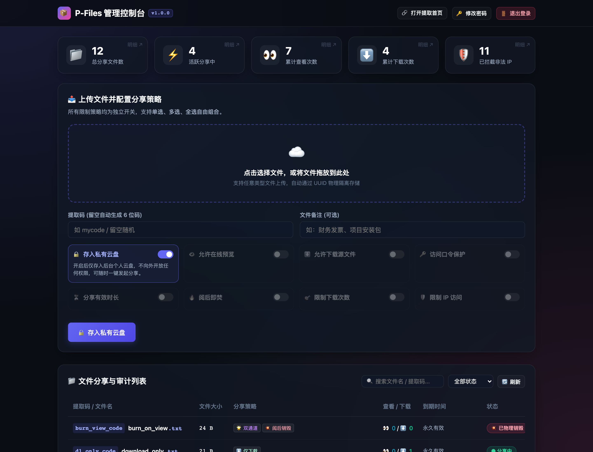
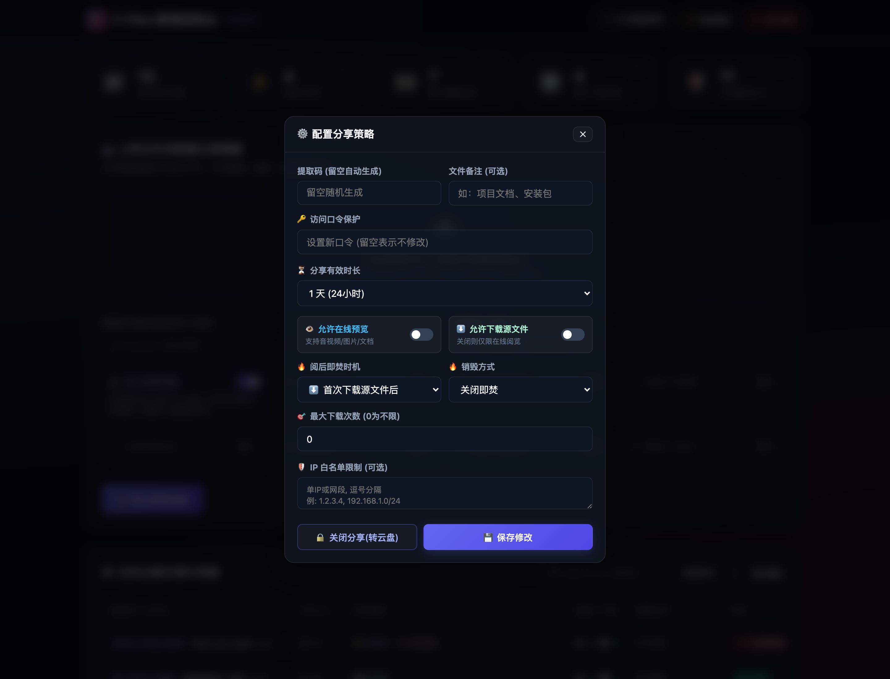
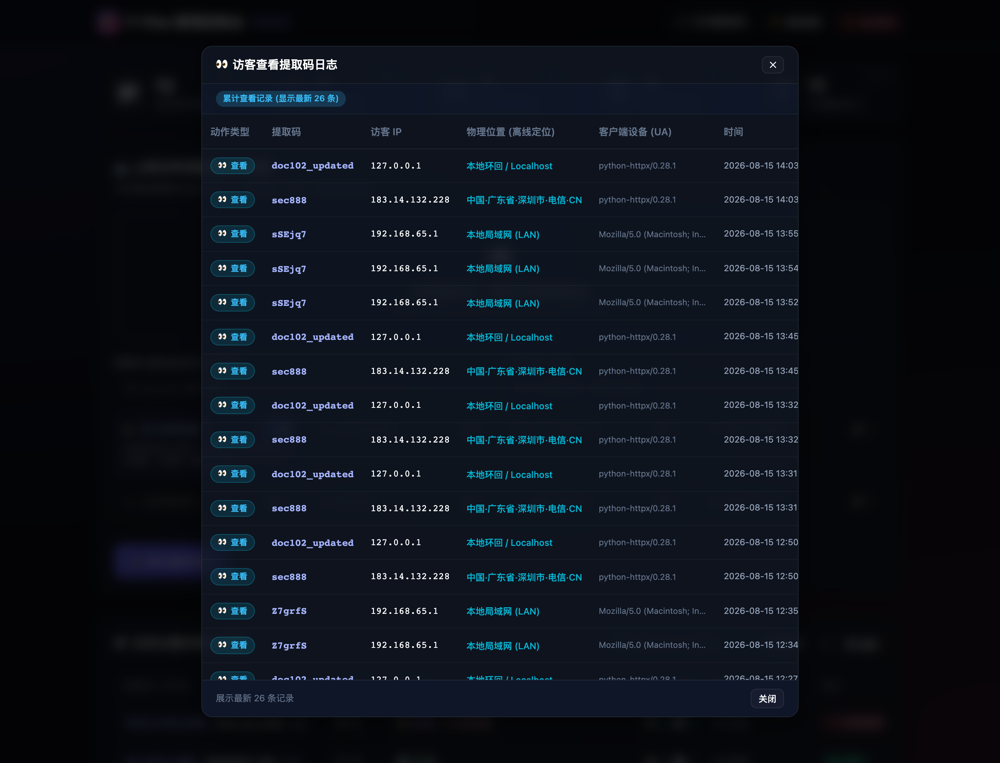
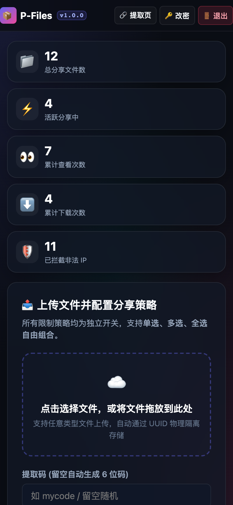
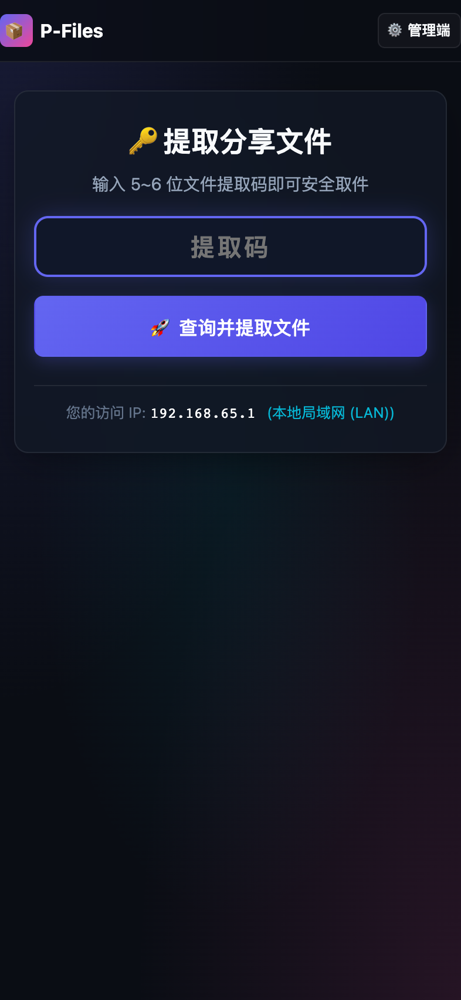

# 📦 P-Files 安全文件分享系统 (文件快递柜)

<p align="center">
  
  
  
  
  
</p>

> 🚀 **P-Files** 是一个轻量、高效、安全且具备全方位访问控制的独立文件分享系统。支持 **Docker 一键秒级部署**、**提取码取件**、**IP 离线高精度物理地区审计**、**5 项策略自由组合（单选/多选/全选）** 以及 **工业级防爆破与双模式阅后即焚**。

---

## 📸 系统界面预览 (Screenshots)

### 💻 桌面端管理控制台 (Admin Dashboard)
> 暗黑玻璃拟态设计，集成了全盘数据看板、多策略组合上传面板与文件管理列表：

<p align="center">
  
</p>

### ⚙️ 自由组合的策略配置 & 📊 离线物理地区审计
<p align="center">
  
  
</p>

### 📱 移动端沉浸式体验 (Mobile Adaptive)
> 单行 52px 精致 AppBar，智能文本伸缩与纯图标胶囊，为小屏手机释放 55%+ 首屏视野：

<p align="center">
  
  
</p>

---

## ✨ 核心特性

- 🚀 **Docker / Linux 一键极速部署**：提供全自动安装脚本与 Docker Compose，数据和配置自动持久化至本地 `./data`。
- 🎯 **自由组合的多维度分享策略**（支持单选、多选、全选）：
  1. 🔑 **访问口令保护**：支持为文件设置查看/提取密码，防止链接外泄。
  2. ⏳ **有效时长限制**：支持永久有效、10分钟、1小时、1天、7天、30天或自定义小时。
  3. 🔥 **双模式阅后即焚**：
     - **模式 1 (仅失效链接)**：下载 1 次后提取链接立即失效，但源文件保存在后台文件库中，管理员可随时一键“重新开启分享”，无需重复上传大文件。
     - **模式 2 (彻底物理销毁)**：下载 1 次后立即从服务器底层磁盘彻底 `unlink` 物理删除，绝不留痕迹。
  4. 🎯 **最大下载次数限制**：达到设定下载次数后自动关闭分享。
  5. 🛡️ **IP 白名单访问控制**：支持单 IP、多 IP、CIDR 网段（如 `192.168.1.0/24`），非白名单 IP 即使知道密码也直接拒绝并记录审计。
- 📊 **访客 IP 与离线物理地区审计**：
  - 内置 `ip2region` 离线高精度 IP 数据库，毫秒级解析访客省份、城市、运营商（如：`中国·广东省·深圳市 (电信)`）。
  - **绝不调用任何第三方外部 API**，彻底杜绝服务器和访客隐私外泄。
  - 自动记录查看、下载、口令输错、非法 IP 拦截等全方位审计日志。
- 🔒 **严密的安全防护体系**：
  - **防爆破限流 (Rate Limiting)**：连续输错密码或口令自动临时锁定 IP。
  - **路径穿越防御 (Path Traversal)**：文件以 UUID 物理隔离存储，杜绝文件名注入和目录穿越。
  - **后台过期守护**：异步守护协程自动轮询清理过期记录与物理残留。
- 💾 **私有云盘存储模式（先存后发）**：
  - 支持一键将文件直接归档入私有云盘，暂不生成公网提取链接；
  - 随时在后台一键发起定制化安全分享（设置口令/有效时长/即焚），实现“私有网盘 + 快递柜”双重能力。
- 🎬 **多媒体在线流式秒播（HTTP Range 分片传输）**：
  - 管理后台原生支持视频（MP4/WebM/MOV/MKV）、高清图片、音频在线流式播放与全屏预览；
  - 即使是超大视频也能即点即播、任意毫秒级拖动进度条。
- ⚡ **实时上传监控与取消功能**：
  - 提供实时上传进度条（%）、即时传输速度（MB/s）、已传大小与剩余时间（ETA）倒计时；
  - 支持在上传大文件时一键随时【❌ 取消上传】。
- 💎 **轻奢现代 UI 体验**：深色玻璃拟态、微动效卡片、拖拽上传、一键复制分享链接与提取码、全面完美适配手机移动端。

---

## 🚀 快速开始与部署

### 方式 1：Linux 服务器一键全自动安装（推荐，自动检测安装 Docker）

登录服务器后直接执行以下命令：

```bash
curl -fsSL https://raw.githubusercontent.com/kejee/P-Files/main/install.sh | bash
```

> **脚本特性**：
> - 自动检测 Docker 与 Docker Compose；若未安装，将**自动通过官方源安装并启动服务**。
> - 自动生成高强度随机 `SECRET_KEY` 并创建持久化目录 `/opt/p-files/data`。
> - 启动完成后自动在终端打印公网访问地址与初始登录凭证。

---

### 方式 2：直接拉取 GitHub 官方镜像运行（免克隆源码）

如果你不想在服务器上下载整个代码仓库，可以直接拉取 GitHub Packages (GHCR) 构建好的官方多架构镜像运行：

```bash
# 1. 创建本地数据目录
mkdir -p /opt/p-files/data

# 2. 直接后台运行容器
docker run -d \
  --name pfiles-server \
  --restart unless-stopped \
  -p 52080:52080 \
  -v /opt/p-files/data:/app/data \
  -e ADMIN_USERNAME=useradmin \
  -e ADMIN_PASSWORD=admin123456 \
  ghcr.io/kejee/p-files:latest
```

---

### 方式 3：使用 Docker Compose 手动部署 (源码构建)

1. **克隆仓库**：
```bash
git clone https://github.com/kejee/P-Files.git
cd P-Files
```

2. **启动服务**：
```bash
docker compose up -d --build
```

3. **访问系统**：
- **公共文件提取页**：`http://服务器IP:52080`
- **管理控制台**：`http://服务器IP:52080/admin`
  - 默认用户名：`useradmin`
  - 默认初始密码：`admin123456`（首次登录后请在后台右上角点击修改密码）

---

### 方式 4：本地 Python 源码运行 (开发调试)

```bash
# 1. 创建虚拟环境并安装依赖
python3 -m venv .venv
source .venv/bin/activate
pip install -r requirements.txt

# 2. 启动开发服务器
uvicorn main:app --host 127.0.0.1 --port 52080 --reload
```

---

## 📁 数据持久化与备份

系统所有数据（SQLite 数据库、上传的文件、离线 IP 库）均存放在本地 **`./data`** 目录中：

```text
data/
├── uploads/         # 上传的文件存储目录（UUID 重命名隔离存储）
├── pfiles.db        # SQLite 数据库（存储所有提取码、分享策略与访问日志）
└── ip2region.xdb    # 离线 IP 物理位置数据库
```

* **备份与迁移**：日常仅需将 `./data` 目录整体打包拷贝到新服务器即可完成无缝迁移！

---

## 🛡️ 生产环境反向代理与 HTTPS 部署

如果你需要绑定域名并通过 HTTPS 访问，建议使用反向代理直连 VPS，以**解除 Cloudflare 等免费 CDN 的 100MB 上传限制**。

### 🚀 极速一键部署（推荐）
推荐使用开源自动化工具 [**kejee/nginx-ssl**](https://github.com/kejee/nginx-ssl)，一行命令自动配置 Nginx 独立站点、签发免费 SSL 证书并开启大文件直传：

```bash
# 1. 安装工具
curl -fsSL https://raw.githubusercontent.com/kejee/nginx-ssl/main/install.sh | bash

# 2. 一键添加站点（自动申请 SSL、无限制大文件）
add-proxy share.yourdomain.com 52080
```

> 📖 **更多部署方案与安全加固**：
> 包含**自动更新定时脚本（开/闭 IP:端口模式）**、**Caddy 方案**以及**禁止 IP 直接访问安全加固**，请参阅详细文档：👉 [**生产环境部署与运维指南 (DEPLOYMENT.md)**](DEPLOYMENT.md)


---

## ⚖️ 免责声明 (Disclaimer)

1. **软件开源性质**：本系统（P-Files）作为开源软件，仅供个人学习、研究、技术交流以及合法合规的日常文件分发与备份使用。
2. **内容与责任归属**：任何通过本系统上传、下载、存储、传播或分享的文件及内容，**均纯属系统使用者或最终用户的个人独立行为，与本项目作者、代码贡献者及相关维护团队无关**。作者不对任何由第三方上传或传播的内容承担法律责任。
3. **合规性要求**：使用者在部署和使用本系统时，**必须严格遵守所在国家及地区的法律法规与政策规范**。严禁将本系统用于存储、传播或分发任何含有侵犯他人知识产权、色情低俗、赌博、暴力恐怖、木马病毒、恶意软件或其他违法违规的内容。
4. **数据安全自负**：虽然本系统内置了多层安全防护与阅后即焚销毁机制，但使用者仍应自行负责服务器的安全运维、数据备份以及重要资产的安全防护。因服务器环境配置不当、弱口令、网络攻击或天灾人祸等因素导致的数据丢失、泄露或损坏，作者概不承担责任。

---

## 📄 开源许可证

本项目基于 [MIT License](LICENSE) 协议开源。
